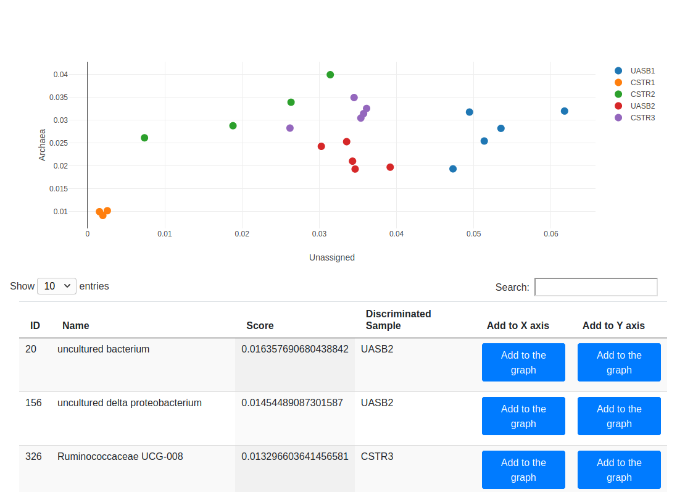
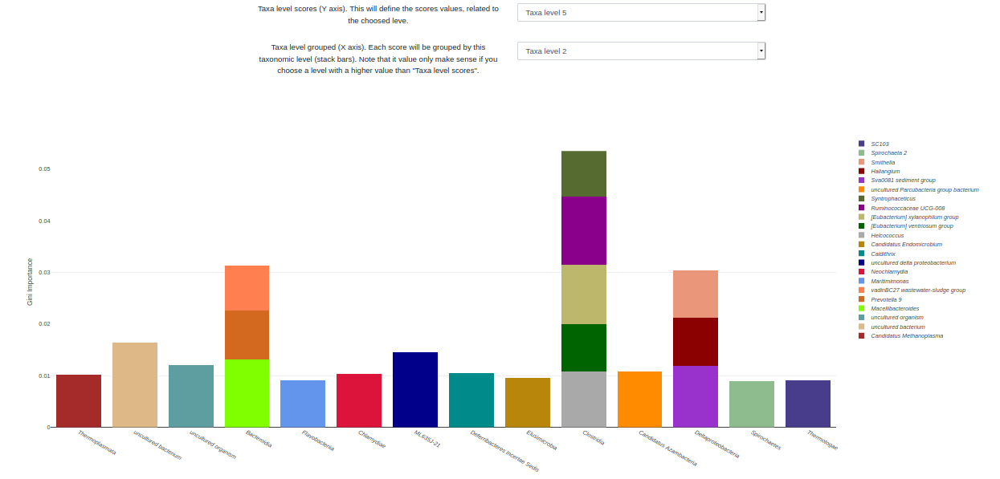
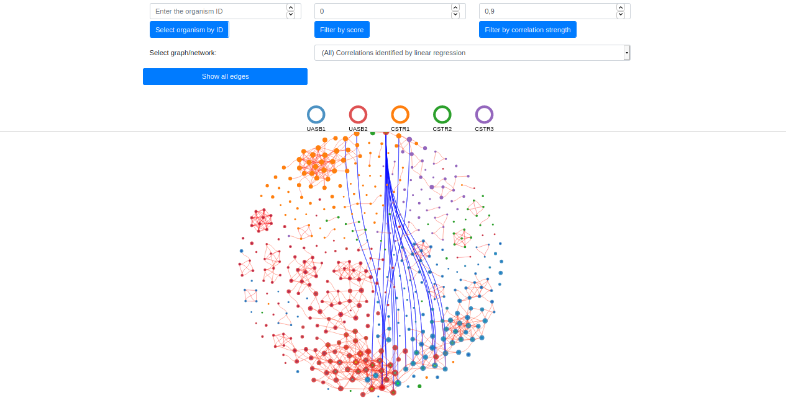
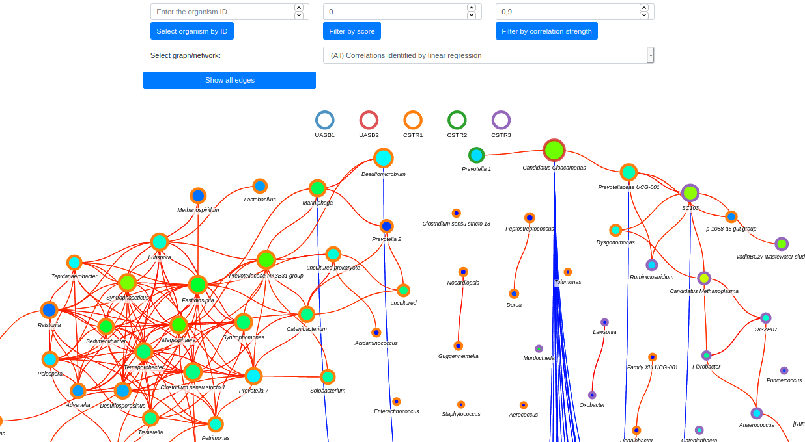

# Microbiome Network Analysis

## About the project
This project is a part of development executed for the paper [Microbial communities network analysis of anaerobic reactors fed with bovine and swine slurry](https://www.sciencedirect.com/science/article/pii/S0048969720338365?casa_token=PcVBqDpuUCEAAAAA:cbPP1EZVfoLxi5-nEJDBI-ktJ9ggLAbzqEAh9Yc5rxRsyZFSe1c3bgnhS7bzN1R_cyXXJOKRzfg).

## Cite the project





```bibtex
@article{vendruscolo2020microbial,
  title={Microbial communities network analysis of anaerobic reactors fed with bovine and swine slurry},
  author={Vendruscolo, Eliane Cristina Gruszka and Mesa, Dany and Rissi, Daniel Vasconcelos and Meyer, Bruno Henrique and de Oliveira Pedrosa, F{\'a}bio and de Souza, Emanuel Maltempi and Cruz, Leonardo Magalh{\~a}es},
  journal={Science of the Total Environment},
  volume={742},
  pages={140314},
  year={2020},
  publisher={Elsevier}
}
```

## How to use it
All commands were tested on Linux, but its possible to adapt the follow steps to Windows or others OS.

### Docker
A simple way to execute the project is using [docker](https://www.docker.com/).
If you have it, execute the follow steps on terminal:


```bash
git clone https://github.com/BrunoMeyer/microbiome_network.git
cd microbiome_network
sudo docker build -t python-microbiomenet .
sudo docker run --rm -d -it --name python-microbiomenet -v "$(pwd)"/src:/microbnet -w "/microbnet" python-microbiomenet
```

Then, you can watch the current status of processing with
```bash
sudo docker ps
sudo docker logs python-microbiomenet
```

The sudo is optional if you have configured your docker.

### Manual
Also, you can execute the commands manually:
```bash
git clone https://github.com/BrunoMeyer/microbiome_network.git
cd microbiome_network
cd src/
pip3 install -r requirements.txt
./create_graph.sh
```

### Visualization of results
After the processing you can visualize the results opening `src/index.html` file with a web browser. There you will see three choices:

- "Scores": Page with relative abundance and table with each taxon and scores extracted from Random Forest
- "Taxon importance chart": Visualization of scores with taxons grouped by different taxonomic levels 
- Network: Network/Graph with correlation analysis between taxons and its scores. Scores represents the discriminative "power"

